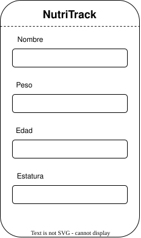

# Semana 4 · Modelo de datos y mockups de NutriTrack

Programa: Ingeniería de Sistemas · Asignatura: Programación Móvil

En esta entrega vamos a definir el modelo de datos de NutriTrack, los wireframes de las 3 pantallas más importantes, el mapa de navegación entre ellas, y se explica qué datos van locales y cuáles remotos. Todo se construyó a partir de las historias de usuario ya anteriormente definidas.

## 1. Modelo de datos

El modelo se diseñó con solo las entidades necesarias para soportar las historias de usuario imprescindibles (H1, H2, H3). Se llegó a 3 entidades.

### 1.1 Entidades y atributos

**Usuario**

| Atributo      | Tipo   | Descripción                                      |
| ------------- | ------ | ------------------------------------------------ |
| id (PK)       | int    | Identificador único                              |
| nombre        | string | Nombre del usuario                               |
| peso          | float  | Peso actual                                      |
| edad          | int    | Edad del usuario                                 |
| estructura    | string | Estructura corporal                              |
| objetivo      | string | Meta del usuario (bajar de peso, mantener, etc.) |
| email         | string | Correo, usado para iniciar sesión                |
| password_hash | string | Contraseña cifrada                               |

**Comida**

| Atributo        | Tipo   | Descripción                              |
| --------------- | ------ | ---------------------------------------- |
| id (PK)         | int    | Identificador único                      |
| usuario_id (FK) | int    | Referencia al usuario dueño del registro |
| franja_id (FK)  | int    | Referencia a la franja horaria           |
| descripcion     | string | Descripción del alimento consumido       |
| fecha           | date   | Fecha en la que se registró la comida    |

**FranjaHoraria**

| Atributo | Tipo   | Descripción               |
| -------- | ------ | ------------------------- |
| id (PK)  | int    | Identificador único       |
| nombre   | string | Desayuno, almuerzo o cena |

Se separó FranjaHoraria como su propia entidad, en vez de dejarla como un simple texto libre dentro de Comida, porque son siempre las mismas 3 opciones fijas (desayuno, almuerzo, cena) y así se evita que un registro termine con un valor mal escrito.

### 1.2 Relaciones

- **Usuario (1) — (N) Comida:** un usuario tiene muchas comidas registradas, pero cada comida pertenece a un solo usuario.
- **FranjaHoraria (1) — (N) Comida:** una franja horaria (por ejemplo "Desayuno") puede estar asociada a muchas comidas, pero cada comida pertenece a una sola franja.

```
Usuario (1) ────< (N) Comida (N) >──── (1) FranjaHoraria
```

No se modeló el resumen semanal como una entidad aparte, porque no es un dato nuevo que haya que guardar: es simplemente una consulta que agrupa los registros existentes de Comida por día. Tampoco se creó una entidad para editar o eliminar comidas (H5), porque esas son acciones sobre un registro de Comida que ya existe.

## 2. Wireframes (baja fidelidad)

Se dibujaron las 3 pantallas que cubren las funciones imprescindibles de la app: crear cuenta, registrar comida, y ver el resumen semanal.

### 2.1 Crear cuenta

Es la primera pantalla que ve el usuario. Pide los datos básicos para personalizar su seguimiento, sin campos de más.



### 2.2 Registrar comida

Permite elegir la franja horaria y escribir una descripción corta del alimento. Es la pantalla que el usuario va a usar más seguido, por eso se mantuvo simple.


### 2.3 Resumen semanal

Muestra las comidas agrupadas por día de los últimos 7 días, indicando cuando un día no tiene registros, más un botón para volver a registrar una comida.


## 3. Mapa de navegación

El usuario crea su cuenta, inicia sesión, y llega a la pantalla principal, desde donde se reparte hacia las dos funciones clave (registrar comida y ver el resumen semanal). Desde el resumen semanal puede entrar a editar o eliminar una comida puntual. No se buscó complicar el flujo con pantallas intermedias que no fueran necesarias.


## 4. Almacenamiento: local vs remoto

| Dato                           | Dónde                        | Por qué                                                                                                             |
| ------------------------------ | ---------------------------- | ------------------------------------------------------------------------------------------------------------------- |
| Comidas registradas            | Remoto (servidor)            | El resumen semanal necesita el historial completo, y el usuario debe poder verlo aunque cambie de dispositivo       |
| Datos de la cuenta (perfil)    | Remoto                       | Permite iniciar sesión desde otro dispositivo si llega a ser necesario                                              |
| Sesión activa (token de login) | Local                        | Evita pedir inicio de sesión cada vez que se abre la app                                                            |
| Caché de las últimas comidas   | Local, se sincroniza después | Hace que la app cargue rápido y funcione un momento sin conexión, relacionado con el requisito de rendimiento en 3G |

En general, la mayoría de los datos vive en remoto porque son el historial real del usuario y no se pueden perder: el valor de la app está justamente en poder revisar la semana completa, no solo el momento actual. Lo local se usa solo para que la experiencia sea rápida (sesión activa y caché), no porque haya una función crítica que deba funcionar sin conexión, como sí ocurre en apps de emergencia.
