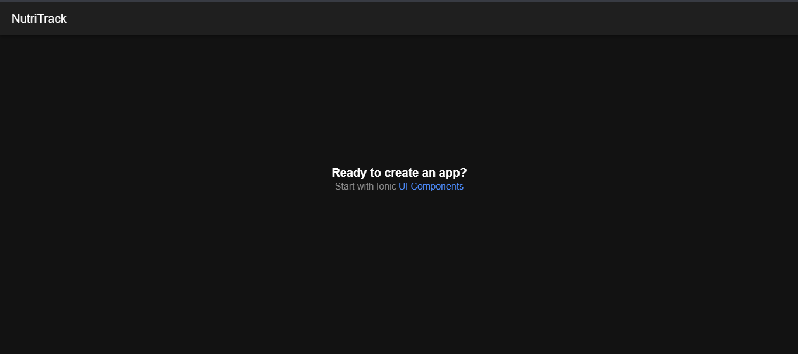

# Semana 6 · Monta tu entorno y crea tu primer proyecto

Programa: Ingeniería de Sistemas · Asignatura: Programación Móvil
Unidad 2, Corte 2

## Pasos realizados

1. **Instalación de Node.js LTS**, que incluye npm como gestor de paquetes.
2. **Instalación del CLI de Ionic** con el comando:
   ```
   npm install -g @ionic/cli
   ```
3. **Creación del proyecto** con la plantilla en blanco de React:
   ```
   ionic start miApp blank --type=react
   ```
4. **Ejecución del proyecto** en el navegador:
   ```
   cd miApp
   ionic serve
   ```
   La app queda disponible en `http://localhost:8100` con recarga automática.
5. **Modificación de la pantalla inicial:** en `src/pages/Home.tsx` se cambió el texto `Blank` por `NutriTrack` en las etiquetas `<IonTitle>`, para reflejar el nombre de la app del proyecto.

## Captura de la pantalla inicial modificada



## Cómo quedó organizado el proyecto

Al correr `ionic start`, Ionic generó automáticamente toda la estructura del proyecto. Las carpetas más relevantes son:

```
miApp/
  src/
    pages/       -> pantallas de la app (cada una es un componente React)
    components/  -> piezas reutilizables entre pantallas
    App.tsx      -> componente raíz, define las rutas
  package.json    -> dependencias y scripts del proyecto
  ionic.config.json
```

El resto de archivos y carpetas (configuración de build, pruebas, linting, etc.) también los crea Ionic por defecto al iniciar el proyecto.
