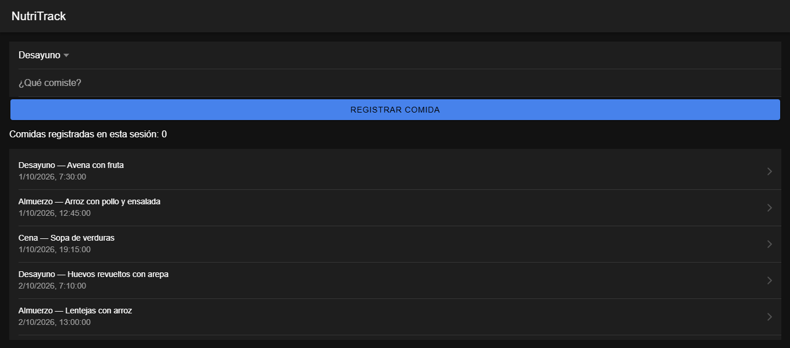
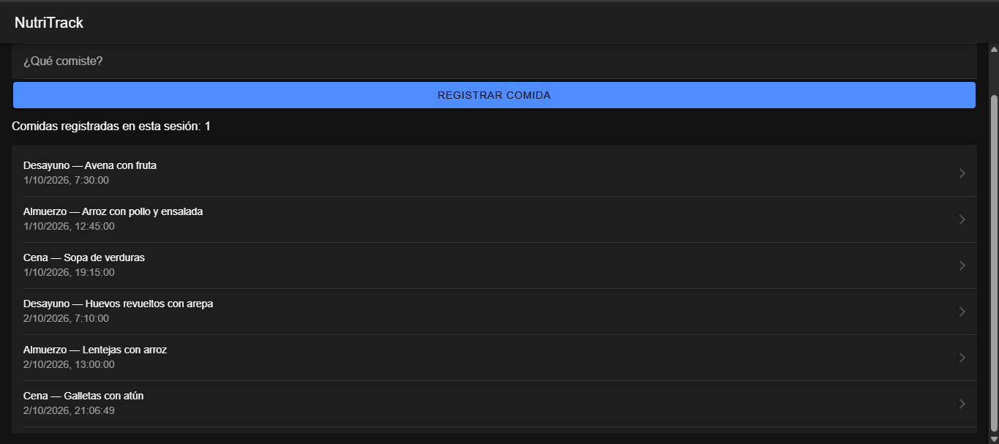
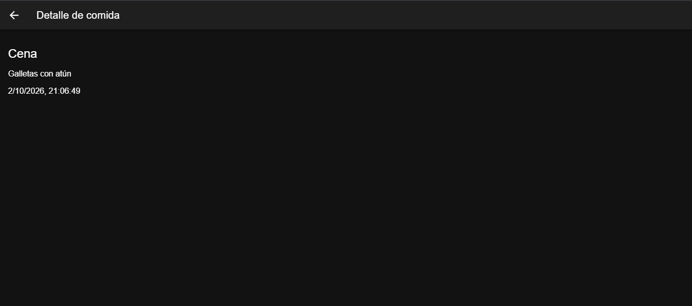

# Semana 9 · Lista de comidas y navegación al detalle en Ionic React

Asignatura: Programación Móvil

## Descripción

Esta semana la pantalla principal de NutriTrack muestra el historial de comidas como una lista hecha con componentes de Ionic React, con un contador de las comidas registradas en la sesión, y al tocar una comida se navega a una segunda página con su detalle.

La lista no está escrita a mano en la app: se carga con `fetch` desde la API construida en la semana 8.

## Estructura

```
09-week/03-optional-activity/nutri-app/
├── api/
│   └── server.js          -> GET /comidas, GET /comidas/:id y POST /comidas
└── app/
    └── src/
        ├── App.tsx            -> rutas: /home y /detalle/:id
        ├── services/
        │   └── comidasApi.ts  -> funciones fetch
        └── pages/
            ├── Home.tsx        -> lista de comidas, formulario y contador
            └── Detalle.tsx     -> segunda página: detalle de una comida
```

## Qué cambió respecto a la semana 8

- `server.js`: se agregó el endpoint `GET /comidas/:id` (devuelve una comida o 404 si no existe), se ampliaron los datos de prueba a 5 comidas, y se habilitó CORS para que el navegador pudiera consumir la API desde la app.
- `comidasApi.ts`: función nueva `obtenerComida(id)` para ese endpoint.
- `Home.tsx`: cada comida de la lista ahora lleva a su detalle, y se agregó el contador de comidas registradas en la sesión.
- `Detalle.tsx`: página nueva.
- `App.tsx`: ruta nueva `/detalle/:id`.

## Lista con componentes de Ionic React

El historial se arma con `IonList`, y cada comida es un `IonItem` con un `IonLabel` adentro. Se recorre con `map`, y cada elemento lleva su `key` (el id de la comida):

```tsx
<IonList>
  {comidas.map((c) => (
    <IonItem key={c.id} routerLink={`/detalle/${c.id}`} detail>
      <IonLabel>
        <h3>
          {c.franja} — {c.descripcion}
        </h3>
        <p>{new Date(c.fecha).toLocaleString()}</p>
      </IonLabel>
    </IonItem>
  ))}
</IonList>
```

Las comidas que aparecen al abrir la app vienen de `GET /comidas`, pedidas una sola vez al abrir la pantalla con `useEffect`.



## Estado con useState

En `Home.tsx` se usa `useState` para la lista que llega de la API, lo que el usuario escribe en el campo de descripción, y un contador de comidas registradas en la sesión:

```tsx
const [registradas, setRegistradas] = useState(0);

async function registrar() {
  await crearComida(franja, descripcion);
  setDescripcion("");
  setRegistradas(registradas + 1);
  cargar();
}
```

El contador empieza en 0 y sube cada vez que se registra una comida; se muestra como "Comidas registradas en esta sesión: 1".



## Navegación a la segunda página

Las rutas se definen en `App.tsx` con React Router:

```tsx
<Route path="/home" element={<Home />} />
<Route path="/detalle/:id" element={<Detalle />} />
```

Cada `IonItem` de la lista tiene `routerLink={/detalle/${c.id}}`, así que al tocarlo navega a esa ruta. `Detalle.tsx` lee el id con `useParams()` y pide ese registro puntual a la API. El `IonBackButton` de la barra superior regresa al historial.

```
/home (lista)  →  /detalle/3 (detalle de la comida 3)  →  volver a /home
```



## Cómo ejecutarlo

API (en una terminal):

```
cd api
npm install
node server.js
```

Queda corriendo en `http://localhost:3000`.

App (en otra terminal, con la API encendida):

```
cd app
npm install
ionic serve
```

Se abre en `http://localhost:8100`.
