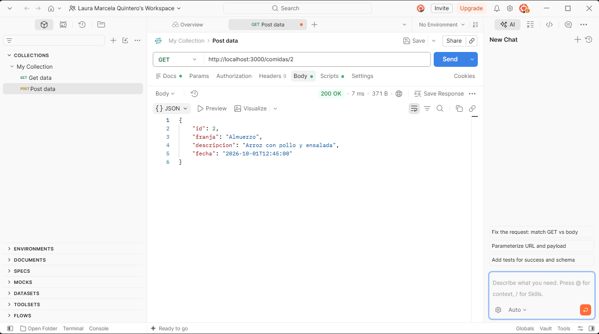
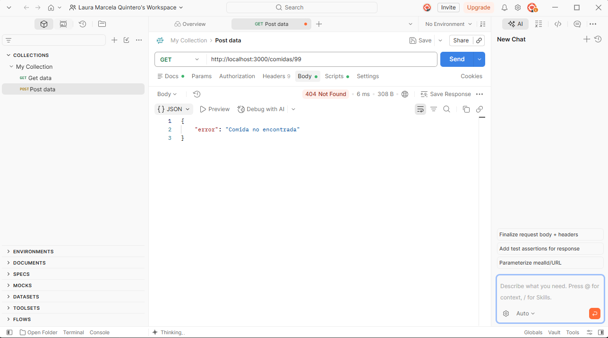
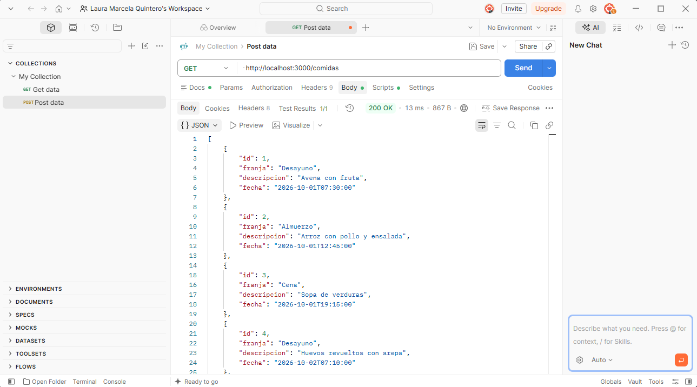
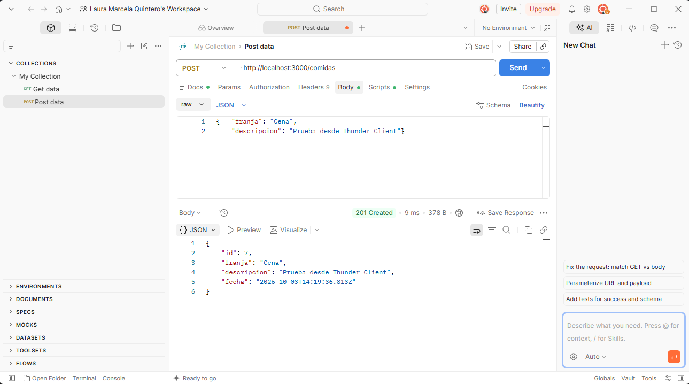
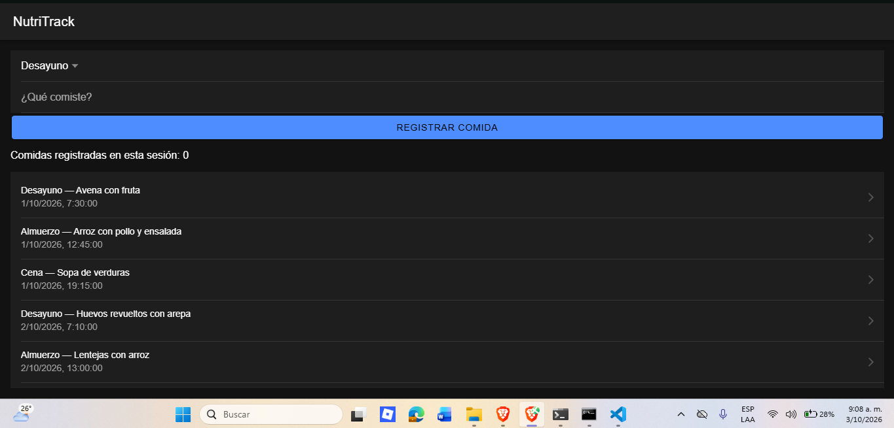
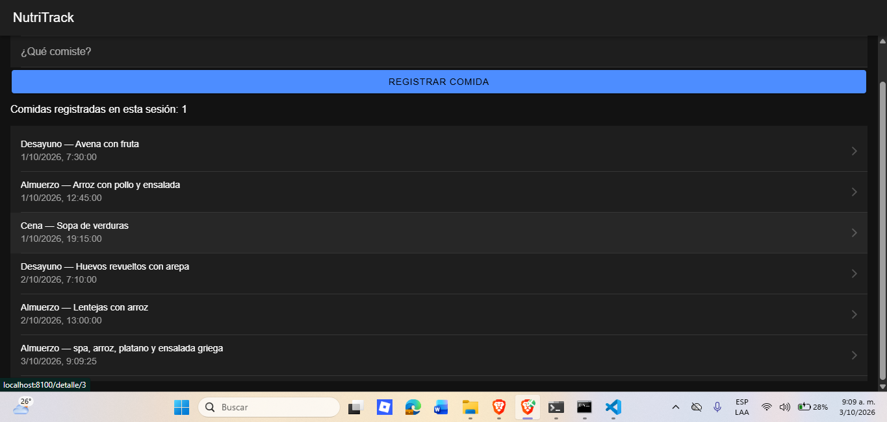
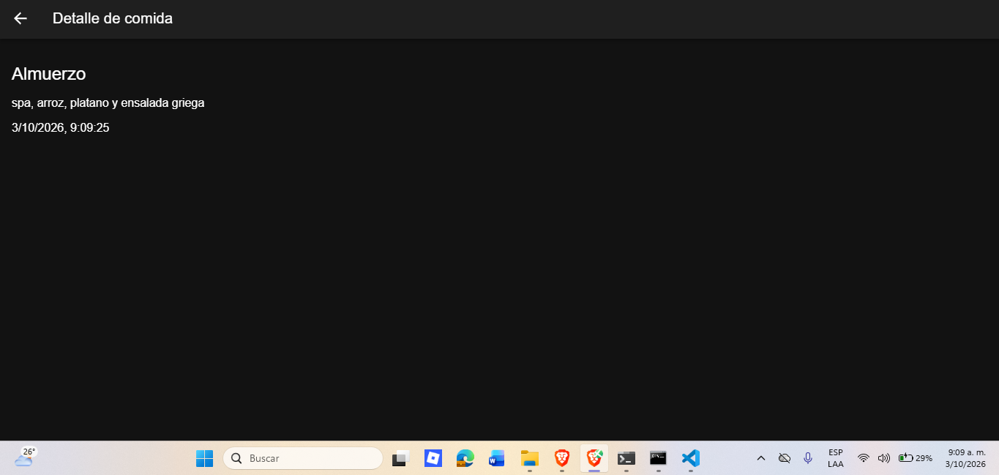

# Corte 2 · App Ionic React + API — NutriTrack

Asignatura: Programación Móvil

## Descripción

API REST mínima con Express para la entidad **comidas**, y una app en Ionic React que lista los registros, permite crear uno nuevo, maneja errores de red con `useState`, y navega a una pantalla de detalle.

## Estructura

```
api/
└── server.js          -> GET /comidas, GET /comidas/:id y POST /comidas
app/
└── src/
    ├── App.tsx            -> rutas: /home y /detalle/:id
    ├── services/
    │   └── comidasApi.ts  -> funciones fetch
    └── pages/
        ├── Home.tsx        -> lista, formulario y estado
        └── Detalle.tsx     -> pantalla de detalle
evidencias-funcionamiento/
├── lista-comidas.png
├── registro-comida.png
├── detalle-comida.png
├── get-comidas.png
├── post-comidas.png
├── get-comida-por-id.png
└── get-comida-404.png
```

## API Express

Dos endpoints principales sobre la entidad `comidas`:

- `GET /comidas` — devuelve la lista completa, en JSON.
- `POST /comidas` — crea una comida nueva (requiere `franja` y `descripcion` en el body); si falta alguno, responde `400`.

Además hay un tercer endpoint, `GET /comidas/:id`, que trae un solo registro por su id y responde `404` si no existe — se usa para la pantalla de detalle.





Probada directamente con Postman:





## Pantalla Ionic React (listar + crear)

`Home.tsx` pide la lista con `fetch` al abrir la pantalla (`useEffect`), y la muestra con `IonList`. Tiene un formulario (franja horaria + descripción) que, al enviarse, hace un `POST` a la API y vuelve a pedir la lista actualizada. Mientras se guarda, el botón se deshabilita y muestra un spinner; al terminar, aparece un toast de confirmación.





## Estado con useState

Se usa `useState` para: la lista que llega de la API, los campos del formulario, un contador de comidas registradas en la sesión, el estado de carga, el estado de guardado (para el spinner), y el mensaje de error si algo falla.

## Manejo de errores y navegación

Todas las llamadas a la API están envueltas en `try/catch`: si el servidor está apagado o la petición falla, la app muestra "No se pudo conectar con el servidor" en vez de romperse. También se valida el formulario antes de enviar: si la descripción está vacía, no se llama a la API y se muestra un aviso.

Cada comida de la lista navega a `/detalle/:id` con React Router; `Detalle.tsx` lee el id con `useParams()`, pide ese registro puntual, y el `IonBackButton` regresa al historial.



## Architecture

The API is built with Express and has three endpoints for the comidas (meals) entity. The `GET /comidas` endpoint returns the full list of meals in JSON format. The `GET /comidas/:id` endpoint returns only one meal, using the id from the URL; if the meal does not exist, the API returns a 404 error. The `POST /comidas` endpoint creates a new meal; it needs a `franja` (time of day) and a `descripcion` in the request body, and it returns a 400 error if one of them is missing. The Ionic React app uses fetch functions inside `comidasApi.ts` to call these endpoints: one function gets the full list for the Home screen, one function creates a new meal when the user submits the form, and another function gets a single meal for the Detalle (detail) screen. All these calls use try/catch, so if the server is down, the app shows an error message instead of crashing.

## Cómo ejecutarlo

API (en una terminal):
```
cd api
npm install
node server.js
```
Queda corriendo en `http://localhost:3000`.

App (en otra terminal, con la API encendida):
```
cd app
npm install
ionic serve
```
Se abre en `http://localhost:8100`.
